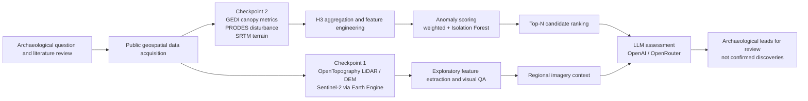
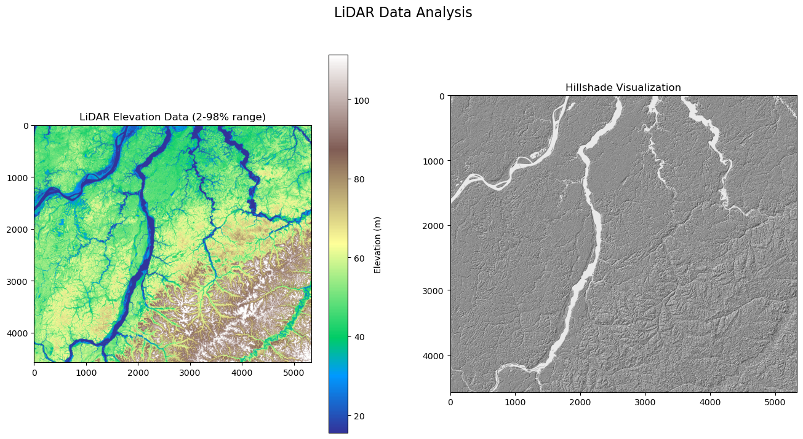
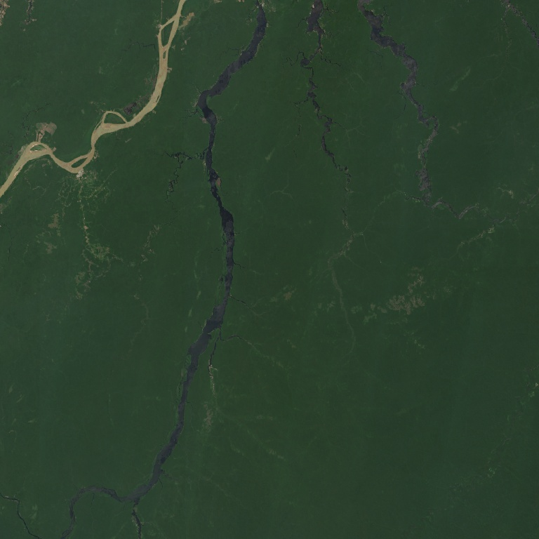
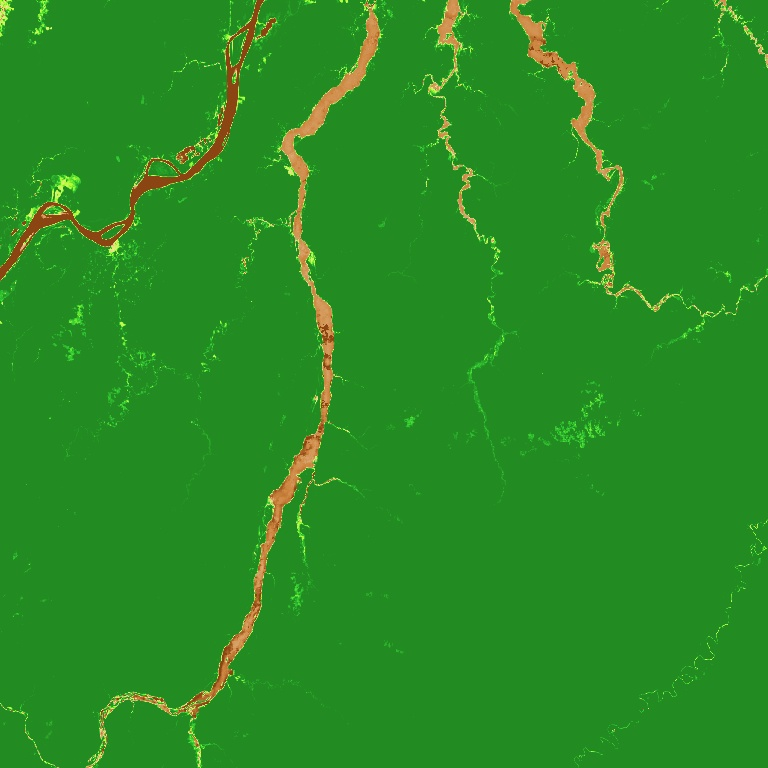
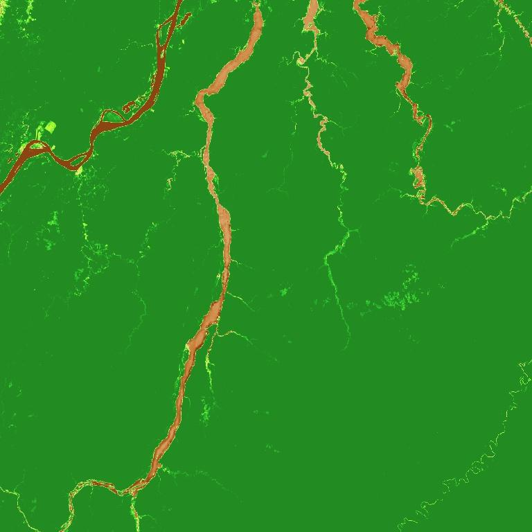

# OpenAI to Z Challenge

AI-assisted archaeological prospecting in the Amazon using public geospatial data, anomaly scoring, and LLM-based interpretation.

## TL;DR

I built an AI-assisted archaeological anomaly pipeline that combines public remote-sensing datasets, geospatial feature engineering, anomaly ranking, and LLM-based interpretation to surface candidate leads for further investigation.

The project evolved across two challenge checkpoints:

- **Checkpoint 1** explored LiDAR / DEM and Sentinel-2 workflows, then used language models to produce plain-English interpretations of extracted terrain and imagery features.
- **Checkpoint 2** expanded the project into a multi-source anomaly-detection pipeline using GEDI, PRODES, SRTM, H3 spatial aggregation, weighted scoring, Isolation Forest ranking, and LLM-assisted cell assessment.

This repository is best understood as a serious challenge prototype in archaeological AI: part research sprint, part remote-sensing pipeline, part engineering artifact. It is not evidence of a confirmed archaeological discovery. It is evidence of a technical attempt to turn a hard, uncertain archaeological search problem into a reproducible computational workflow.

## Why this project matters

The [OpenAI to Z Challenge](https://openai.com/openai-to-z-challenge/) asked participants to apply frontier models and open geospatial data to a century-old archaeological mystery: whether remote sensing, historical evidence, and AI-assisted analysis could help identify possible hidden archaeological sites in the Amazon biome.

The interesting technical problem was not to have a model announce a lost city. The real challenge was to:

- translate messy archaeological and environmental literature into a usable search strategy;
- combine heterogeneous public geospatial sources into one workflow;
- identify anomalous locations worth deeper review;
- use LLMs as interpretation and triage tools rather than as oracles;
- stay honest about uncertainty, reproducibility drift, and evidentiary limits.

That is the standard this project aims to meet.

## What I built

### Checkpoint 1

A lightweight remote-sensing workflow that:

- fetches LiDAR / DEM data through OpenTopography;
- fetches Sentinel-2 imagery through Google Earth Engine;
- extracts terrain and spectral features;
- generates natural-language model interpretations through OpenAI or OpenRouter.

Key files:

- `CHECKPOINT_1/Checkpoint_1.ipynb`
- `CHECKPOINT_1/dataset_fetching.py`
- `CHECKPOINT_1/feature_extraction.py`
- `CHECKPOINT_1/openai_integration.py`
- `CHECKPOINT_1/console_output.py`

### Checkpoint 2

A more advanced archaeological anomaly pipeline that:

- fetches GEDI canopy structure, PRODES disturbance context, and SRTM terrain data;
- aggregates observations onto H3 cells;
- engineers per-cell features;
- scores cells with both weighted heuristics and Isolation Forest anomaly detection;
- ranks top candidate cells for follow-up;
- adds regional context and cell-level assessments through LLM prompting.

Key files:

- `CHECKPOINT_2/Checkpoint_2.ipynb`
- `CHECKPOINT_2/dataset_fetching.py`
- `CHECKPOINT_2/feature_engineering.py`
- `CHECKPOINT_2/anomaly_detect.py`
- `CHECKPOINT_2/model_integration.py`
- `CHECKPOINT_2/console_output.py`

## Pipeline overview



## Visual outputs

The checkpoint notebooks produced visual QA artifacts that helped inspect the region across terrain and spectral representations.

| LiDAR / hillshade context | Regional RGB context |
| --- | --- |
|  |  |

| Derived index map | Checkpoint 2 derived context map |
| --- | --- |
|  |  |

These images are documentation artifacts extracted from the preserved notebooks, not newly generated results.

## Results snapshot

Preserved project artifacts show that the pipeline produced real intermediate and final outputs worth documenting:

- Checkpoint 2 documentation reports a feature-engineering run producing **3,407 H3 cells** from **20,708 GEDI shots** and **3,000 SRTM points**.
- `CHECKPOINT_2/test-run_top5.json` contains five ranked candidate cells with feature vectors.
- `CHECKPOINT_2/test-run_top5_llm.json` contains regional context plus cell-level LLM assessments.
- In the preserved top-5 run, candidate cell `898aa919897ffff` was rated `medium` potential with verification priority `3`, largely because recent deforestation could expose otherwise hidden surface features; the other four candidates were rated `low`.
- The regional assessment described a dense, largely undisturbed riverine rainforest landscape where subtle topography, paleochannels, and localized vegetation anomalies deserved attention.

That is an appropriately modest outcome for this kind of challenge: not a sensational claim, but a structured shortlist of leads supported by data fusion and explicit reasoning.

See [`docs/results.md`](docs/results.md) for more detail.

## Selected artifacts

Core entry points:

- [`CHECKPOINT_1/README.md`](CHECKPOINT_1/README.md)
- [`CHECKPOINT_2/README.md`](CHECKPOINT_2/README.md)
- [`CHECKPOINT_1/Checkpoint_1.ipynb`](CHECKPOINT_1/Checkpoint_1.ipynb)
- [`CHECKPOINT_2/Checkpoint_2.ipynb`](CHECKPOINT_2/Checkpoint_2.ipynb)

Preserved outputs:

- [`CHECKPOINT_2/test-run_top5.json`](CHECKPOINT_2/test-run_top5.json) — ranked top candidate feature vectors.
- [`CHECKPOINT_2/test-run_top5_llm.json`](CHECKPOINT_2/test-run_top5_llm.json) — regional assessment and cell-level LLM analysis.

Documentation:

- [`docs/setup.md`](docs/setup.md) — environment, API keys, and service setup.
- [`docs/reproducibility.md`](docs/reproducibility.md) — what can be rerun today and what depends on live services.
- [`docs/results.md`](docs/results.md) — preserved result interpretation.
- [`docs/research/source-library.md`](docs/research/source-library.md) — selected research and source grounding.

## Research and source grounding

This project sits on top of both challenge-specific materials and real archaeological / remote-sensing literature.

Challenge and implementation context:

- [OpenAI to Z Challenge](https://openai.com/openai-to-z-challenge/)
- [Official checkpoints PDF](https://cdn.openai.com/pdf/a9455c3b-c6e1-49cf-a5cc-c40ed07c0b9f/checkpoints-openai-to-z-challenge.pdf)
- [Kaggle starter materials discussion](https://www.kaggle.com/competitions/openai-to-z-challenge/discussion/579189)
- [Kaggle notebook: Search the Amazon with Remote Sensing and AI](https://www.kaggle.com/code/fnands/search-the-amazon-with-remote-sensing-and-ai)
- [Kaggle notebook: OpenAI to Z Challenge Checkpoint 2](https://www.kaggle.com/code/ndy001/openai-to-z-challenge-checkpoint-2#Checkpoint-2---An-Early-Explorer)

Archaeological and methodological grounding:

- [Predicting the geographic distribution of ancient Amazonian archaeological sites with machine learning](https://pmc.ncbi.nlm.nih.gov/articles/PMC10069417/)
- [Pre-Columbian earth-builders settled along the entire southern rim of Amazonia](https://www.nature.com/articles/s41467-018-03510-7)
- [Lidar reveals pre-Hispanic low-density urbanism in the Bolivian Amazon](https://pmc.ncbi.nlm.nih.gov/articles/PMC9177426/)
- [Historical human footprint on modern tree species composition in the Purus-Madeira interfluve, central Amazonia](https://journals.plos.org/plosone/article?id=10.1371/journal.pone.0048559)
- [Ethics in Archaeological Lidar](https://journal.caa-international.org/articles/10.5334/jcaa.48)

See [`docs/research/source-library.md`](docs/research/source-library.md) for the curated source list.

## Repository structure

```text
openai-to-z-challenge/
├── README.md
├── assets/
│   └── readme/
│       ├── checkpoint1-lidar-hillshade-panel.png
│       ├── checkpoint1-regional-rgb-context.png
│       ├── checkpoint1-derived-index-map.png
│       └── checkpoint2-derived-context-map.jpg
├── docs/
│   ├── setup.md
│   ├── reproducibility.md
│   ├── results.md
│   └── research/
│       └── source-library.md
├── CHECKPOINT_1/
│   ├── Checkpoint_1.ipynb
│   ├── README.md
│   ├── console_output.py
│   ├── dataset_fetching.py
│   ├── feature_extraction.py
│   ├── openai_integration.py
│   ├── requirements.txt
│   └── environment.yml
└── CHECKPOINT_2/
    ├── Checkpoint_2.ipynb
    ├── README.md
    ├── anomaly_detect.py
    ├── console_output.py
    ├── dataset_fetching.py
    ├── feature_engineering.py
    ├── feature_extraction.py
    ├── model_integration.py
    ├── test-run_top5.json
    ├── test-run_top5_llm.json
    ├── requirements.txt
    └── tests/
```

## Current reproducibility status

This repo is documentable now, but only partially reproducible without additional setup.

What has been preserved:

- checkpoint notebooks as historical challenge artifacts;
- modularized Python files for both checkpoints;
- Checkpoint 2 ranked candidate outputs;
- Checkpoint 2 LLM assessment output;
- cached raw/test data used during development.

What requires live credentials or refreshed setup:

- Google Earth Engine-dependent reruns;
- OpenTopography API calls;
- OpenAI/OpenRouter LLM calls;
- full Checkpoint 2 end-to-end pipeline execution.

Most honest reproduction guidance:

- easiest path to inspect: preserved notebooks and JSON artifacts;
- easiest path to rerun after dependency setup: Checkpoint 1 LiDAR workflow;
- safest Checkpoint 2 engineering target: offline/mock tests after the test suite is cleaned;
- full Checkpoint 2 reruns should be treated as credentialed geospatial workflow reproduction, not as a guaranteed one-command run.

See [`docs/setup.md`](docs/setup.md) and [`docs/reproducibility.md`](docs/reproducibility.md).

## Technical skills demonstrated

This repository shows practical evidence of:

- geospatial data acquisition and preprocessing;
- remote-sensing interpretation;
- raster and terrain analysis;
- H3-based spatial aggregation;
- feature engineering for anomaly detection;
- unsupervised ML triage with Isolation Forest;
- prompt design for structured LLM interpretation;
- model-provider abstraction across OpenAI and OpenRouter;
- prototype-to-documentation cleanup under imperfect reproducibility.

